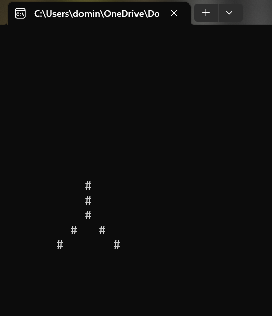

<!--
*** Thanks for checking out c. If you have a suggestion
*** that would make this better, please fork the repo and create a pull request
*** or simply open an issue with the tag "enhancement".
*** Thanks again! Now go create something AMAZING! :D
-->

<!-- PROJECT SHIELDS -->
<!--
*** I'm using markdown "reference style" links for readability.
*** Reference links are enclosed in brackets [ ] instead of parentheses ( ).
*** See the bottom of this document for the declaration of the reference variables
*** for contributors-url, forks-url, etc. This is an optional, concise syntax you may use.
*** https://www.markdownguide.org/basic-syntax/#reference-style-links
-->

[![Contributors][contributors-shield]][contributors-url]
[![Forks][forks-shield]][forks-url]
[![Stargazers][stars-shield]][stars-url]
[![Issues][issues-shield]][issues-url]
[![LinkedIn][linkedin-shield]][linkedin-url]
[![NO LICENSE][license-shield]][license-url]

<!-- PROJECT LOGO -->
<br />
<p align="center">
  <a href="https://gdansk.pja.edu.pl/pl/">
    
  </a>

  <h2 align="center">C++</h2>

<p align="center">
    <h3>     CLI simulation in C++
 </h3>
    <!-- <br />
    <a href="https://github.com/dccstcc/GRK_PJATK_practice"><strong>» go to CODE »</strong></a>
    <br />
    <br />  -->
    <!-- <a href="https://github.com/othneildrew/Best-README-Template">View Demo</a>
    ·
    <a href="https://github.com/othneildrew/Best-README-Template/issues">Report Bug</a>
    ·
    <a href="https://github.com/othneildrew/Best-README-Template/issues">Request Feature</a> -->
  </p>
</p>

<!-- TABLE OF CONTENTS -->
<details open="open">
  <summary>Table of Contents</summary>
  <ol>
    <li>
      <a href="#project-description">Project description</a>
      <ul>
        <li><a href="#libraries-and-frameworks">Libraries / Frameworks</a></li>
      </ul>
    </li>
    <li>
      <a href="#native-deploy">Native deploy</a>
      <ul>
        <li><a href="#prerequisites">Prerequisites</a></li>
        <li><a href="#installation">Installation</a></li>
      </ul>
    </li>
    <li><a href="#how-to-use">How to use ?</a></li>
    <!-- <li><a href="#roadmap">Roadmap</a></li>
    <li><a href="#contributing">Contributing</a></li> -->
    <li><a href="#license">License</a></li>
    <li><a href="#contact">Contact with me</a></li>
    <!-- <li><a href="#acknowledgements">Acknowledgements</a></li> -->
  </ol>
</details>

<!-- ABOUT THE PROJECT -->

## Project description

In this project I created simple demo as part of game module to use in Command Line window. I used C++.

### Libraries and frameworks

This project use technology below.

- [![Cpp][cpp-shield]][cpp-url]
- [![Dev-Cpp][devcpp-shield]][devcpp-url]

<!-- GETTING STARTED -->

## Native deploy

This is instructions on setting up this project locally.

### Prerequisites

Windows OS is need. <br/>
Dev-C++ IDE with compiler is need. <br/>

### Installation

1. Clone the repo
   ```sh
   git clone https://github.com/dominik-stec/Cpp.git
   ```
2. Install Dev-C++ - Integrated Development Environment for C++ with compiler
   `https://www.bloodshed.net/`
   <br/><br>
   <i>It's important not to use UNIX based compiler for this project like g++ or cpp. <br>
   This project run natively only in Windows OS. </i>
   <br/><br>
3. Open file `final_proj.cpp` from final_project directory into IDE
4. Compile source file and after that run compiled binary `final_proj.exe`

<!-- USAGE EXAMPLES -->

## How to use

You can navigate object in this simulation using keyboard arrows and resize object with + or - keys.

<br>

Choose object view and its size.


<br />

Move and resize object:




<br />

Generate new object view:


<!-- _For more examples, please refer to the [Documentation](https://example.com)_ -->

<!-- ROADMAP
## Roadmap

See the [open issues](https://github.com/othneildrew/Best-README-Template/issues) for a list of proposed features (and known issues).

-->

<!-- CONTRIBUTING
## Contributing

Contributions are what make the open source community such an amazing place to learn, inspire, and create. Any contributions you make are **greatly appreciated**.

1. Fork the Project
2. Create your Feature Branch (`git checkout -b feature/AmazingFeature`)
3. Commit your Changes (`git commit -m 'Add some AmazingFeature'`)
4. Push to the Branch (`git push origin feature/AmazingFeature`)
5. Open a Pull Request

-->

<!-- LICENSE -->

## License

This project has not a license.
All rights are reserved and it is not Open Source or free. You cannot modify or redistribute this code without explicit permission from the copyright holder, because projects which I realised are private conception from PJATK studies.
See `LICENSE` for more information.

<!-- CONTACT -->

## Contact

Dominik Stec - dccstcc@gmail.com

[![LinkedIn][linkedin-shield]][linkedin-url]

Project URL:
<br />
`https://github.com/dominik-stec/Cpp.git`

<!-- ACKNOWLEDGEMENTS
## Acknowledgements
* [GitHub Emoji Cheat Sheet](https://www.webpagefx.com/tools/emoji-cheat-sheet)
* [Img Shields](https://shields.io)
* [Choose an Open Source License](https://choosealicense.com)
* [GitHub Pages](https://pages.github.com)
* [Animate.css](https://daneden.github.io/animate.css)
* [Loaders.css](https://connoratherton.com/loaders)
* [Slick Carousel](https://kenwheeler.github.io/slick)
* [Smooth Scroll](https://github.com/cferdinandi/smooth-scroll)
* [Sticky Kit](http://leafo.net/sticky-kit)
* [JVectorMap](http://jvectormap.com)
* [Font Awesome](https://fontawesome.com)

-->

<!-- MARKDOWN LINKS & IMAGES -->
<!-- https://www.markdownguide.org/basic-syntax/#reference-style-links -->

[contributors-shield]: https://img.shields.io/github/contributors/dominik-stec/Cpp_PJA.svg?style=for-the-badge
[contributors-url]: https://github.com/dominik-stec/Cpp_PJA/graphs/contributors
[forks-shield]: https://img.shields.io/github/forks/dominik-stec/Cpp_PJA.svg?style=for-the-badge
[forks-url]: https://github.com/dominik-stec/Cpp_PJA/network/members
[stars-shield]: https://img.shields.io/github/stars/dominik-stec/Cpp_PJA.svg?style=for-the-badge
[stars-url]: https://github.com/dominik-stec/Cpp_PJA/stargazers
[issues-shield]: https://img.shields.io/github/issues/dominik-stec/Cpp_PJA.svg?style=for-the-badge
[issues-url]: https://github.com/dominik-stec/Cpp_PJA/issues
[license-shield]: https://img.shields.io/badge/License-NONE-orange
[license-url]: https://github.com/dominik-stec/Cpp_PJA/blob/master/LICENSE.md
[linkedin-shield]: https://img.shields.io/badge/-LinkedIn-black.svg?style=for-the-badge&logo=linkedin&colorB=555
[linkedin-url]: https://www.linkedin.com/in/dominik-stec
[product-screenshot]: images/screenshot.png
[php-shield]: https://img.shields.io/badge/-PHP-red
[php-url]: https://www.php.net/
[cpp-shield]: https://img.shields.io/badge/-Cpp-green
[cpp-url]: https://devdocs.io/cpp/
[devcpp-shield]: https://img.shields.io/badge/-DevCpp-blue
[devcpp-url]: https://www.bloodshed.net/
